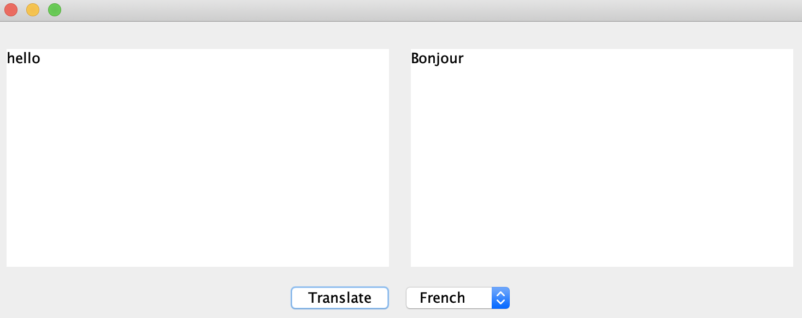

# translator
> A language translator application

## Table of contents
* [General info](#general-info)
* [Screenshots](#screenshots)
* [Technologies](#technologies)
* [Setup](#setup)
* [Features](#features)
* [Status](#status)
* [Inspiration](#inspiration)
* [Contact](#contact)

## General info
This is a Java application that uses the strategy software design pattern

## Screenshots

## Technologies
* Java 11

## Setup
Download the src folder and run it in local Java IDE

## Features
List of features ready and TODOs for future development
* Translate "hello" from English to French/German/Spanish

To-do list:
* Expand vocabulary to translate
* Exand both languages translated from and translated to

## Status
Project is in progress.

## Contact
Created by [CherylTan](https://www.linkedin.com/in/cheryl-tan-72176684/) - feel free to contact me!
